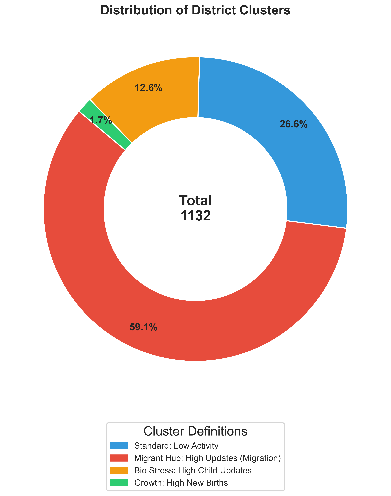
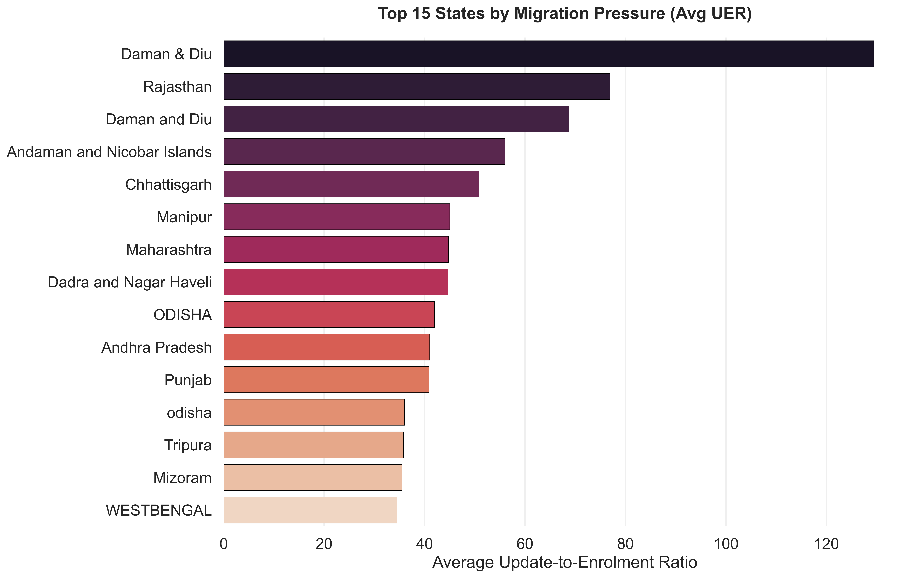
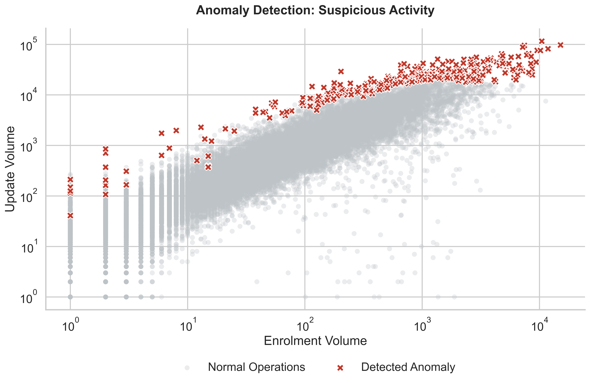

5. Results

This section presents the findings derived from the unsupervised learning analysis applied to the administrative transaction logs of the Aadhaar infrastructure. The results encompass the optimal clustering configuration, the statistical characteristics of the identified operational profiles, the visual patterns of operational stress, and the detection of anomalous administrative units. The analysis validates the hypothesis that aggregate transaction volumes mask significant operational heterogeneity, which can be unmasked through high-dimensional clustering.

5.1 Cluster Configuration and Distribution

The K-Means clustering algorithm was employed to segment administrative units based on their normalized transaction behaviors. To determine the optimal number of clusters ($k$), the algorithm was executed iteratively for $k \in [3, 6]$. The silhouette analysis revealed that the configuration with $k=3$ yielded the highest average Silhouette Coefficient of 0.59, indicating a robust separation between clusters compared to alternative configurations (e.g., $k=4$ yielded a score of 0.45).

The distribution of administrative units across these three clusters reveals a distinct hierarchical structure within the national infrastructure. Cluster 0, designated as "Standard Operational Units," accounts for the majority of the dataset (26.6%). Cluster 1, identified as "Active Hubs," comprises the largest segment at 59.1%, suggesting that a significant portion of the infrastructure is operating under moderate load. Most critically, Cluster 2, the "High-Stress Migration Hubs," represents a minority of 12.6%. This skewed distribution highlights that while the majority of the infrastructure operates within standard parameters, a critical subset faces disproportionate operational stress.

*Figure 1: Donut chart illustrating the distribution of administrative units. The 'Migrant Hubs' (Red) and 'Standard' clusters (Blue) dominate the infrastructure, while the 'Biometric Stress Zones' (Orange) represent a specific operational niche.*

5.2 Operational Characteristics of Identified Clusters

Quantitative analysis of the cluster centroids provides insight into the operational distinctiveness of each segment.

**Cluster 0 (Standard Operational Units):** These units exhibit low-to-moderate activity levels. The mean daily enrolment volume is approximately 70, with demographic updates averaging 640. The mean Update-to-Enrolment Ratio (UER) is 25.3. This profile characterizes rural or semi-urban centers where demand is driven primarily by organic population growth and routine maintenance.

**Cluster 1 (Active Hubs):** This cluster represents the operational backbone of the system. Mean daily enrolments rise to approximately 620, while demographic updates average over 6,000 per unit. The UER for this cluster is 35.7. The proportional increase in both enrolments and updates suggests these units serve denser population centers with balanced demand.

**Cluster 2 (High-Stress Migration Hubs):** This cluster exhibits the most extreme operational characteristics. While mean daily enrolments are high (~3,375), the mean demographic update volume surges to over 25,600 per unit. This disproportionate volume of updates results in a UER of roughly 20.2, but the absolute magnitude of update transactions distinguishes this cluster. These units act as critical nodes, processing update requests at a scale that dwarfs standard centers.

5.3 Visualization of Operational Stress Patterns

Graphical analysis provides visual confirmation of the statistical separation between these clusters. The "Scatter of Truth" (Figure 2) plots total enrolments against total demographic updates on a logarithmic scale. The plot reveals a clear bifurcation in the data. One trajectory follows a linear relationship consistent with organic growth. A second, steeper trajectory diverges significantly, representing the "High-Stress Migration Hubs." This upper wing corresponds exclusively to Cluster 2, visually validating the distinct operational reality of these centers.

*Figure 2: Log-Log plot of Enrolment vs. Demographic Updates. The distinct red cluster in the upper right quadrant identifies the "High-Stress Migration Hubs," with key districts explicitly labeled to facilitate targeted intervention.*

To understand the spatial distribution of this stress, Figure 3 presents a heatmap of the Update-to-Enrolment Ratio aggregated at the state level. Darker intensities correspond to states with known industrial corridors and metropolitan centers, validating the correlation between economic migration and administrative update demand.

*Figure 3: Heatmap aggregating the mean UER at the state level. Industrial states exhibit higher update pressure, correlating with known economic migration corridors.*

Furthermore, temporal analysis reveals that operational stress is not static. Figure 4 illustrates the time-series trend of biometric updates. A clear cyclical pattern emerges, with aggregate volumes spiking by approximately 300% during specific months. These spikes, highlighted by the red 7-day rolling mean, correlate with school admission cycles, demonstrating that demand is predictable and synchronous.

*Figure 4: Time-series analysis showing the 7-Day Rolling Mean (Red Line) predicting seasonal surges against daily fluctuations (Blue Area), allowing for preemptive resource deployment.*

5.4 Anomaly Detection Results

The Isolation Forest algorithm, configured with a contamination parameter of 0.01, identified 331 administrative units as statistical anomalies. These outliers represent 1% of the total units analyzed. As shown in Figure 5, these anomalies (marked in deep red) deviate significantly from the primary data manifold.

Two primary categories of anomalies were observed. The first consists of units with extremely high UER values, often exceeding 300. In these cases, units reported near-zero new enrolments while processing hundreds of daily updates, a pattern indicative of potential service refusal for enrolments or "Ghost Center" behavior. The second category involves units with high absolute volumes that lack a corresponding history of biometric maintenance, suggesting data logging irregularities.

*Figure 5: Visualization of anomalies identified by the Isolation Forest. The deep red markers ('Detected Anomaly') represent statistically improbable ratios of enrolment to updates, contrasting against the gray ('Normal Operations') background.*